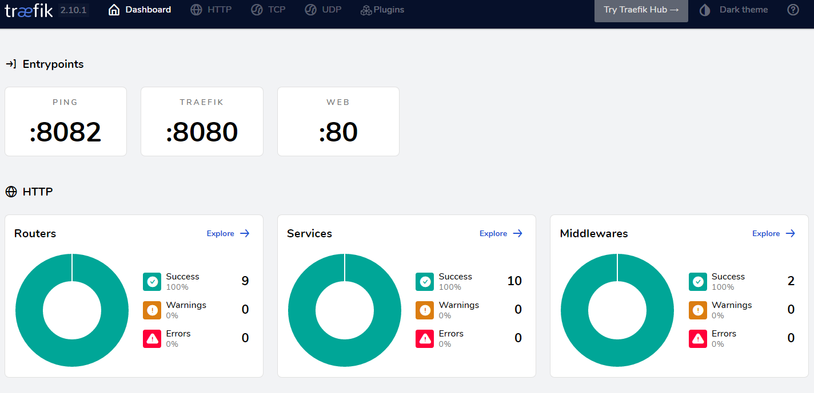
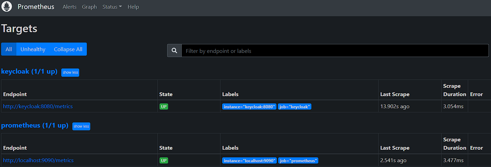

Fork from https://github.com/eabykov/keycloak-compose.git
The original project was not working for me (On the WSL 2 Grafana dont starts issue). So my idea is to use traefik for making the solution more flexible and more robust.
But it is not working yet: Grafana returns status 502 "Bad gateway"

1. Requires [docker](https://docs.docker.com/get-docker/) with [compose](https://docs.docker.com/compose/install/)
2. Parameterized using variables in the [`.env`](.env) file
3. Up the project using command:
```sh
docker compose up -d --wait
```

| Useful commands | Description
|-|-
| `docker stats` | Containers resource usage (`--no-stream` only pull the first result)
| `docker compose logs` | Shows logs of containers (`-f` to follow logs)
| `docker compose down` | Stop and remove containers (`-v` remove named volumes declared in the volumes section of the Compose file and anonymous volumes attached to containers)
| `docker system prune -a -f` | Remove all unused containers, networks, images (`--volumes` prune volumes)

| App | Host | Username | Password | Image
|-|-|-|-|-
| Traefik | http://traefik.localhost/dashboard/#/ | |  | 
| Keycloak | http://keycloak.localhost | `admin` | `keycloak` | 
| Prometheus | http://prometheus.localhost | | | 
| Grafana | http://grafana.localhost | `admin` | `grafana` | 

Stargazers over time

[](https://starchart.cc/eabykov/keycloak-compose)

